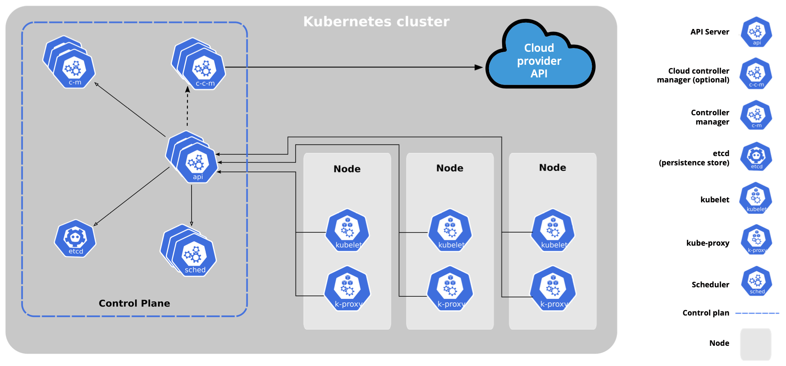

# Kubernetes

Kubernetes as the pilot on a ship of containers (k8s)

## Kubernetes Features

- Automatic bin packing: Kubernetes automatically schedules containers based on resource needs and constraints, to maximize utilization without sacrificing availability.
- Designed for extensibility: Kubernetes cluster can be extended with new custom features without modifying the upstream source code.
- Self-healing: Kubernetes automatically replaces and reschedules containers from failed nodes. It terminates and then restarts containers that become unresponsive to health checks, based on existing rules/policy. It also prevents traffic from being routed to unresponsive containers.
- Horizontal scaling: With Kubernetes applications are scaled manually or automatically based on CPU or custom metrics utilization.
- Service discovery and load balancing: Containers receive IP addresses from Kubernetes, while it assigns a single Domain Name System (DNS) name to a set of containers to aid in load-balancing requests across the containers of the set.

Additional fully supported Kubernetes features are:

- Automated rollouts and rollbacks: Kubernetes seamlessly rolls out and rolls back application updates and configuration changes, constantly monitoring the application's health to prevent any downtime.
- Secret and configuration management: Kubernetes manages sensitive data and configuration details for an application separately from the container image, in order to avoid a rebuild of the respective image. Secrets consist of sensitive/confidential information passed to the application without revealing the sensitive content to the stack configuration, like on GitHub.
- Storage orchestration: Kubernetes automatically mounts software-defined storage (SDS) solutions to containers from local storage, external cloud providers, distributed storage, or network storage systems.
- Batch execution: Kubernetes supports batch execution, long-running jobs, and replaces failed containers.
- IPv4/IPv6 dual-stack: Kubernetes supports both IPv4 and IPv6 addresses.

## Architecture

Kubernetes is a cluster of compute systems categorized by their distinct roles:

- One or more control plane node:
- One or more worker nodes (optional, but recommended).

### Control Plane

Control plane node provides a running environment for the control plane agents responsible for managing the state of a Kubernetes cluster

- It is important to keep the control plane running at all costs.
  - To ensure the control plane's fault tolerance, control plane node replicas can be added to the cluster, configured in High-Availability (HA) mode.
- To persist the Kubernetes cluster's state, all cluster configuration data is saved to a distributed key-value store which only holds cluster state related data
  - The key-value store may be configured on the control plane node (stacked topology), or on its dedicated host (external topology) to help reduce the chances of data store loss by decoupling it from the other control plane agents.

#### Control Plane Node Components

A control plane node runs the following essential control plane components and agents:

- API Server: All the administrative tasks are coordinated by the kube-apiserver
  - The API Server intercepts RESTful calls from users, administrators, developers, operators and external agents, then validates and processes them.
  - During processing the API Server reads the Kubernetes cluster's current state from the key-value store, and after a call's execution, the resulting state of the Kubernetes cluster is saved in the key-value store for persistence.
  - The API Server is the only control plane component to talk to the key-value store, both to read from and to save Kubernetes cluster state information - acting as a middle interface for any other control plane agent inquiring about the cluster's state.
- Scheduler: kube-scheduler is to assign new workload objects, such as pods encapsulating containers, to nodes - typically worker nodes
  - During the scheduling process, decisions are made based on current Kubernetes cluster state and new workload object's requirements.
  - The scheduler obtains from the key-value store, via the API Server, resource usage data for each worker node in the cluster. The scheduler also receives from the API Server the new workload object's requirements which are part of its configuration data.
  - Once all the cluster data is available, the scheduling algorithm filters the nodes with predicates to isolate the possible node candidates which then are scored with priorities in order to select the one node that satisfies all the requirements for hosting the new workload.
  - The outcome of the decision process is communicated back to the API Server, which then delegates the workload deployment with other control plane agents.
- Controller Managers: running controllers or operator processes to regulate the state of the Kubernetes cluster
  - Controllers are watch-loop processes continuously running and comparing the cluster's desired state (provided by objects' configuration data) with its current state (obtained from the key-value store via the API Server).
  - kube-controller-manager runs controllers or operators responsible to act when nodes become unavailable, to ensure container pod counts are as expected, to create endpoints, service accounts, and API access tokens.
  - cloud-controller-manager runs controllers or operators responsible to interact with the underlying infrastructure of a cloud provider when nodes become unavailable, to manage storage volumes when provided by a cloud service, and to manage load balancing and routing.
- Key-Value Data Store (etcd): used to persist a Kubernetes cluster's state.
  - New data is written to the data store only by appending to it, data is never replaced in the data store. Obsolete data is compacted (or shredded) periodically to minimize the size of the data store.
  - Out of all the control plane components, only the API Server is able to communicate with the etcd data store.
  - etcd's CLI management tool - etcdctl, provides snapshot save and restore capabilities which come in handy especially for a single etcd instance Kubernetes cluster
  - etcd is based on the [Raft Consensus Algorithm](https://web.stanford.edu/~ouster/cgi-bin/papers/raft-atc14) which allows a collection of machines to work as a coherent group that can survive the failures of some of its members.

In addition, the control plane node runs:

- Container Runtime
- Node Agent
- Proxy
- Optional add-ons for cluster-level monitoring and logging.
